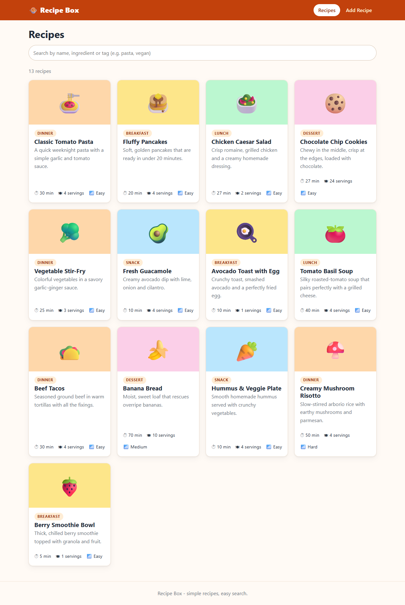
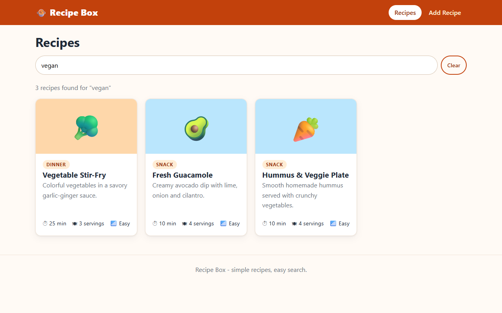
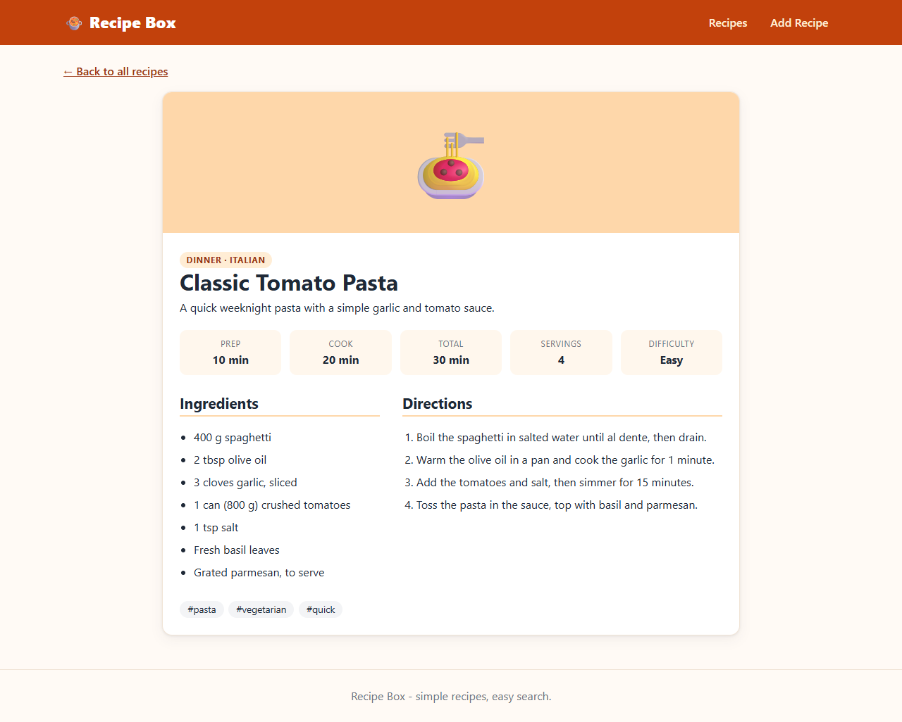

# Recipe Box

A small React app for browsing recipes. Shows a list of recipe cards, a detail
page for each recipe, search, and a form to add your own recipes.

## Tech Stack

- React (Vite), scaffolded with `npx create-vite`
- React Router for routing and the URL-based search query
- Context API for the recipe list
- Plain CSS, no UI library

## Getting Started

```bash
npm install
npm run dev
```

Then open http://localhost:5173.

Other scripts:

```bash
npm run build     # production build
npm run lint      # oxlint
npm run preview   # serve the production build
```

## Features

- **Recipe list**: responsive grid of recipe cards (image, category, description, time, servings, difficulty)
- **Recipe detail**: ingredients, numbered directions, quick facts and tags (`/recipes/:id`)
- **Search**: filters by title, description, category, cuisine, tags and ingredients.
  Case-insensitive, multi-word, with a "no results" message and a Clear button.
  The query is stored in the URL (`/?search=vegan`), so refresh and Back/Forward keep it.
- **Add recipe**: validated form; new recipes are saved in `localStorage` and appear at the top of the list
- 13 sample recipes across Breakfast, Lunch, Dinner, Dessert and Snack
- Keyboard accessible, with a skip link, labelled form fields and live result counts

## Project Structure

```
src/
  data/recipes.js            Sample recipe data
  context/                   RecipesProvider + useRecipes hook
  components/                Header, RecipeCard, RecipeDetail, SearchBar
  pages/                     RecipeListPage, RecipeDetailPage, AddRecipePage
  utils/                     searchRecipes, validateRecipe, storage
docs/screenshots/            App screenshots
```

## Recipe Data Shape

```js
{
  id, title, description, category, cuisine, emoji,
  prepMinutes, cookMinutes, servings, difficulty,
  ingredients: [string], steps: [string], tags: [string]
}
```

## Screenshots

| List | Search | Detail |
| --- | --- | --- |
|  |  |  |
